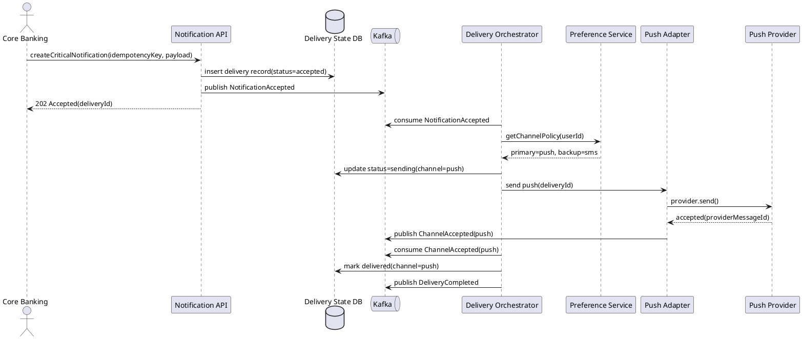
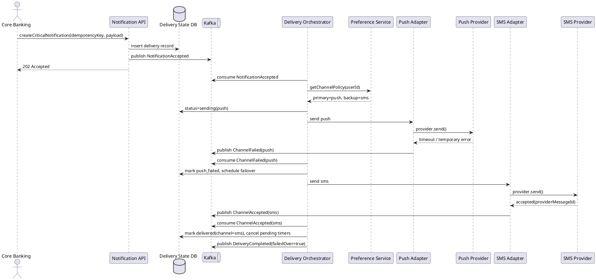
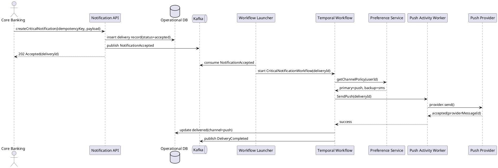
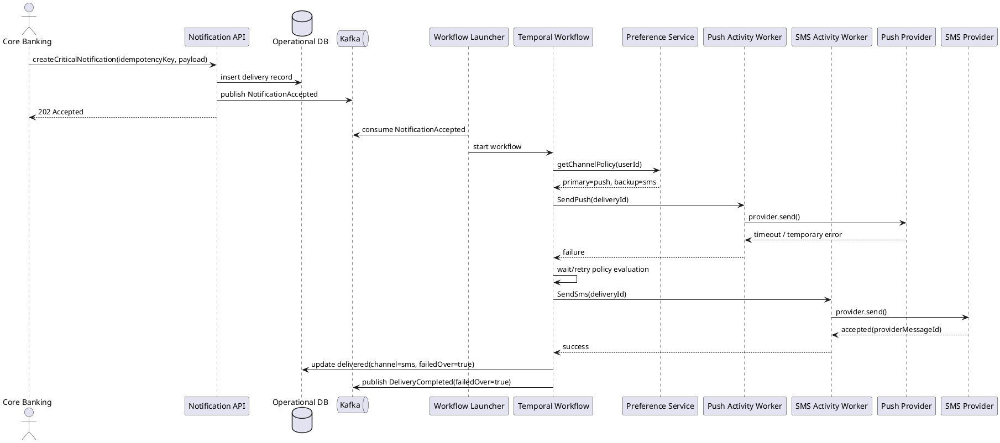

# RFC: Гарантированная доставка критичных уведомлений с кросс-канальным failover

| Метаданные | Значение |
|------------|----------|
| **Статус** | DESIGN |
| **Автор(ы)** | Daria Fominykh |
| **Ответственный** | Daria Fominykh |
| **Бизнес-заказчик** | Product Owner Notification Platform |
| **Ревьюеры** | Architecture Board, 2026-04-07 |
| **Дата создания** | 2026-04-07 |
| **Дата обновления** | 2026-04-07 |

---

## Оглавление

1. [Контекст](#контекст)
2. [Продуктовый анализ](#продуктовый-анализ)
3. [Пользовательские сценарии](#пользовательские-сценарии)
4. [Статистика](#статистика)
5. [Требования](#требования)
6. [Варианты решения](#варианты-решения)
7. [Сравнительный анализ](#сравнительный-анализ)
8. [Выводы](#выводы)
9. [Связанные задачи](#связанные-задачи)
10. [Приложения](#приложения)

---

## Контекст

> **Цель раздела:** Описать проблему или возможность, которую решает данное предложение.

В текущем состоянии банка разные продуктовые сервисы отправляют уведомления самостоятельно, через разные SDK, провайдеров и правила повторных попыток. Это приводит к трём системным проблемам:

1. Критичные транзакционные уведомления не имеют единой гарантии доставки.
2. При деградации внешних провайдеров каждая команда реализует failover по-своему или не реализует вообще.
3. Банк не может централизованно доказать, что уведомление было принято, отправлено, переведено на резервный канал или окончательно не доставлено.

Для транзакционных событий это критично: подтверждение перевода, списание средств и похожие события напрямую влияют на доверие клиента, восприятие безопасности и нагрузку на поддержку. Подсистема гарантированной доставки должна стать частью общей Notification Platform и взять на себя единые правила маршрутизации, failover, идемпотентности и observability.

### Ключевые вопросы

- Как обеспечить доставку критичного уведомления хотя бы через один канал при нестабильности push/SMS/email провайдеров?
- Как минимизировать стоимость доставки, не отправляя SMS по умолчанию там, где достаточно push?
- Как избежать дублей при переключении между каналами и при повторных запросах от источника?
- Как предоставить прозрачный audit trail для поддержки, антифрода и эксплуатации?

---

## Продуктовый анализ

Критичные уведомления отличаются от сервисных и маркетинговых тем, что они:

- связаны с деньгами, безопасностью и юридически значимыми действиями
- ожидаются пользователем почти мгновенно
- не могут быть полностью отключены
- требуют объяснимого поведения в спорных случаях

### Продуктовые принципы

| Принцип | Решение |
|--------|---------|
| Обязательность | Критичные транзакционные уведомления нельзя отключить полностью. |
| Предпочтение пользователя | Пользователь может выбрать основной канал среди подтверждённых каналов, но не может запретить резервный канал для критичных уведомлений. |
| Минимизация стоимости | По умолчанию основной канал — push, если токен валиден и пользователь активен в мобильном приложении. SMS используется как резервный канал, email — как третий канал или запасной цифровой канал. |
| Минимизация дублей | Уведомление считается логически завершённым после первого успешного канала; последующие попытки отменяются или блокируются. |
| Прозрачность | Пользовательская и операционная стороны должны видеть понятный статус: `accepted`, `sending`, `delivered`, `failed_over`, `exhausted`. |

### Канальная политика для критичных уведомлений

| Канал | Роль | Плюсы | Минусы | Когда использовать |
|------|------|-------|--------|--------------------|
| Push | Основной | Дёшево, быстро, хороший UX | Нет полной гарантии доставки на устройство, завязка на токен и приложение | Первый выбор при валидном токене |
| SMS | Резервный | Наиболее надёжный канал для срочного контакта | Дорого, есть ограничения провайдеров и операторов | Второй выбор для failover или если нет push |
| Email | Третий канал | Дёшево, легко масштабируется | Более высокая задержка и ниже вероятность мгновенного прочтения | Третий выбор или fallback при отсутствии телефона |

### Целевой UX для пользователя

- Если всё работает штатно, пользователь получает push почти мгновенно.
- Если push не подтверждён вовремя или провайдер вернул ошибку, система без участия продукта переключается на SMS.
- Если SMS недоступен или контакт не подтверждён, система использует email как крайний цифровой канал.
- Пользователь не получает несколько одинаковых сообщений из-за внутренних повторов платформы; остаточный риск дубля допускается только в редком случае неопределённого состояния у внешнего провайдера.

---

## Пользовательские сценарии

> **Цель раздела:** Описать как пользователи будут взаимодействовать с системой.

| Приоритет | Тип сценария | Действующее лицо | Сценарий |
|-----------|--------------|------------------|----------|
| MUST HAVE | Основной | Клиент банка | После успешного перевода клиент почти мгновенно получает push-уведомление о списании средств. |
| MUST HAVE | Failover | Клиент банка | Если push-провайдер недоступен или push не подтверждён за целевое время, клиент получает SMS как резервный канал. |
| MUST HAVE | Обязательность | Клиент банка | Клиент не может полностью отключить транзакционные уведомления, но может выбрать предпочтительный основной канал среди подтверждённых контактов. |
| MUST HAVE | Операционный | Система-источник / поддержка | Система-источник и сотрудник поддержки видят статус уведомления, историю попыток, выбранный канал и факт переключения на резервный канал. |
| SHOULD HAVE | Cost-aware | Платформа | Для клиента с валидным push-токеном SMS не отправляется сразу, если нет оснований считать основной канал неуспешным. |
| SHOULD HAVE | Resilience | Эксплуатация | При деградации одного SMS-провайдера платформа переключает отправку на альтернативного провайдера в том же канале, не меняя бизнес-API. |
| COULD HAVE | Smart Routing | Платформа | Для VIP или high-risk операций система может использовать более агрессивную политику failover и более короткие таймауты. |

**Приоритеты:**

- **MUST HAVE** — обязательно к реализации
- **SHOULD HAVE** — желательно реализовать
- **COULD HAVE** — опционально, при наличии ресурсов

---

## Статистика

### Исходные данные

- MAU: `10 млн`
- DAU: `3 млн`
- Peak Concurrent Users: `300 000`
- Среднее число транзакционных уведомлений на пользователя в день: `2`
- Среднее число сервисных уведомлений на пользователя в день: `3`
- Среднее число маркетинговых уведомлений на пользователя в день: `5`

### Базовый объём

| Тип уведомлений | Формула | Объём в день |
|----------------|---------|--------------|
| Транзакционные | `3 000 000 * 2` | `6 000 000` |
| Сервисные | `3 000 000 * 3` | `9 000 000` |
| Маркетинговые | `3 000 000 * 5` | `15 000 000` |
| Итого | `3 000 000 * 10` | `30 000 000` |

### Средняя нагрузка

```text
Средний RPS по всем уведомлениям = 30 000 000 / 86 400 ≈ 347 уведомлений/сек
Средний RPS по критичным уведомлениям = 6 000 000 / 86 400 ≈ 69 уведомлений/сек
```

### Пиковая нагрузка и запас

Для критичных уведомлений принимаем коэффициент пика `x8` относительно среднего значения. Это покрывает дневные всплески, зарплатные дни и аварийные сценарии.

```text
Peak critical RPS = 69 * 8 ≈ 552 уведомления/сек
```

Предположения для failover:

- `80%` критичных уведомлений идут в push как в основной канал
- при аварии push-провайдера почти все эти уведомления уйдут в SMS как резерв
- `5%` уведомлений в штатном режиме требуют межканального failover

```text
Штатный peak send attempts ≈ 552 * 1.05 ≈ 580 попыток/сек
Peak при полном отказе push ≈ 552 primary + 442 SMS failover ≈ 994 попытки/сек
С инженерным запасом x2 целевая мощность контура = 2 000 попыток/сек
```

### Объём событий наблюдаемости

Если на одно критичное уведомление в среднем приходится 4 события (`accepted`, `attempted`, `provider_status`, `final_status`), то:

```text
6 000 000 * 4 = 24 000 000 событий/день
```

Это означает, что audit trail и observability нельзя хранить только в транзакционной OLTP-таблице без политики архивации и партиционирования.

---

## Требования

### Функциональные требования

> **Определение:** Функциональные требования определяют, каким должно быть поведение продукта в тех или иных условиях.

| № | Приоритет | Обозначение | Требование |
|---|-----------|-------------|------------|
| 1 | MUST HAVE | FR1 | Подсистема должна принимать запрос на отправку критичного уведомления один раз и присваивать ему уникальный delivery-id и idempotency key. |
| 2 | MUST HAVE | FR2 | Подсистема должна выбирать основной и резервные каналы доставки на основе типа уведомления, подтверждённых контактов, пользовательских настроек и политики банка. |
| 3 | MUST HAVE | FR3 | Подсистема должна начать отправку в основной канал сразу после приёма уведомления. |
| 4 | MUST HAVE | FR4 | При явной ошибке канала или отсутствии положительного результата за установленное время подсистема должна автоматически запустить failover на резервный канал. |
| 5 | MUST HAVE | FR5 | Как только хотя бы один канал достиг успешного терминального состояния, подсистема должна завершить доставку уведомления и остановить лишние резервные попытки. |
| 6 | MUST HAVE | FR6 | Подсистема должна предотвращать логические дубли при повторных запросах от источника, повторной доставке события из брокера и гонках между основным и резервным каналом. |
| 7 | MUST HAVE | FR7 | Подсистема должна хранить историю всех попыток доставки, смены статусов, причин failover и идентификаторов сообщений у провайдеров. |
| 8 | MUST HAVE | FR8 | Если ни один допустимый канал не завершился успешно, подсистема должна перевести уведомление в финальный статус `exhausted` и сгенерировать операционное событие для разбора. |
| 9 | SHOULD HAVE | FR9 | Подсистема должна поддерживать внутрикальный failover между несколькими провайдерами одного канала без изменения API для продуктовых систем. |

### Нефункциональные требования

> **Определение:** Нефункциональные требования определяют не что система делает, а как хорошо она это делает.

| № | Приоритет | Обозначение | Требование |
|---|-----------|-------------|------------|
| 1 | MUST HAVE | NFR1 | Для критичных уведомлений время от `accepted` до первой попытки отправки должно быть `P95 <= 2 сек`, `P99 <= 5 сек`. |
| 2 | MUST HAVE | NFR2 | Время до запуска резервного канала при отрицательном результате или отсутствии подтверждения от основного канала должно быть `<= 5 сек` для `P95` случаев. |
| 3 | MUST HAVE | NFR3 | Подсистема должна выдерживать не менее `700` входящих критичных уведомлений/сек и не менее `2 000` попыток доставки/сек с запасом по мощности. |
| 4 | MUST HAVE | NFR4 | Для принятых критичных уведомлений `RPO = 0`, `RTO <= 15 минут`. |
| 5 | MUST HAVE | NFR5 | Месячная успешность завершения обработки критичных уведомлений при доступности хотя бы одного канала должна быть не ниже `99.95%`. |
| 6 | MUST HAVE | NFR6 | Доля дублей, созданных платформой для одной пары `notification_id + channel`, должна быть не выше `0.01%`. |
| 7 | MUST HAVE | NFR7 | Для `100%` критичных уведомлений должны быть доступны correlation ID, история попыток, технические метрики и алерты на ухудшение SLO не позднее `1 минуты`. |
| 8 | MUST HAVE | NFR8 | Контактные данные пользователя должны храниться и передаваться в зашифрованном виде, а в логах и событиях быть маскированы. |

**Расчёт нагрузок:**
```text
Input critical RPS avg  = 6 000 000 / 86 400 ≈ 69/сек
Input critical RPS peak = 69 * 8 ≈ 552/сек
Delivery attempts peak  = 552 * 1.8 ≈ 994/сек при полном отказе push
Target design capacity  = 2 000 попыток/сек с двукратным запасом
```

### Архитектурно значимые требования (ASR)

| ASR | Приоритет | Требование | Связанные FR/NFR | Почему влияет на архитектуру |
|-----|-----------|------------|------------------|-------------------------------|
| ASR1 | MUST HAVE | Низкая задержка доставки критичных уведомлений | FR2, FR3, FR4, NFR1, NFR2 | Влияет на критический путь, необходимость изоляции очередей, кэширования правил и выбора модели взаимодействия компонентов. |
| ASR2 | MUST HAVE | Гарантированная доставка хотя бы через один канал при сбоях провайдеров | FR4, FR5, FR6, FR8, NFR4, NFR5, NFR6 | Требует устойчивого хранения состояния, таймеров, retry/failover логики и контролируемой state machine. |
| ASR3 | MUST HAVE | Полная наблюдаемость и аудит доставки | FR7, FR8, NFR7, NFR8 | Влияет на событийную модель, трассировку, хранение истории и наборы метрик/алертов. |
| ASR4 | SHOULD HAVE | Минимизация стоимости при сохранении гарантии доставки | FR2, FR5, FR9, NFR3 | Требует policy engine, приоритизации дешёвых каналов и управляемого failover без лишних SMS. |

---

## Варианты решения

### Вариант 1: Event-driven оркестратор доставки на Kafka + PostgreSQL

> **Описание:** Выделенный сервис `Critical Delivery Orchestrator` управляет state machine доставки, хранит состояние в PostgreSQL, использует Kafka для событий и отдельные адаптеры для push, SMS и email.

#### Архитектура

**Технологии:**

- `Notification API`: Kotlin + Spring Boot
- `Broker`: Apache Kafka
- `State DB`: PostgreSQL 16 с партиционированием таблиц
- `Cache`: Redis для горячего кэша пользовательских настроек и channel policy
- `Provider adapters`: отдельные stateless сервисы для push/SMS/email
- `Observability`: OpenTelemetry, Prometheus, Grafana, Loki, Tempo
- `Archive/Audit`: S3-совместимое хранилище + ClickHouse для аналитики истории

**C4 Container Diagram**

```plantuml
@startuml
!includeurl https://raw.githubusercontent.com/plantuml-stdlib/C4-PlantUML/master/C4_Container.puml
LAYOUT_LEFT_RIGHT()

Person(customer, "Клиент банка", "Получает критичные уведомления")
System_Ext(core, "Core Banking / Product Systems", "Отправляют события о транзакциях")
System_Ext(push_provider, "Push Provider", "FCM/APNs или агрегатор")
System_Ext(sms_provider, "SMS Provider", "Внешний SMS-шлюз")
System_Ext(email_provider, "Email Provider", "Почтовый провайдер")

System_Boundary(np, "Notification Platform") {
  Container(api, "Notification API", "Kotlin/Spring Boot", "Принимает критичные уведомления и выдает accepted")
  Container(pref, "Preference Service", "Kotlin/Spring Boot", "Хранит подтвержденные контакты и пользовательские настройки")
  Container(orchestrator, "Critical Delivery Orchestrator", "Kotlin/Spring Boot", "Управляет state machine, retry и failover")
  Container(kafka, "Kafka", "Event Bus", "Хранит события accepted, delivery-attempt, status-update")
  ContainerDb(state_db, "Delivery State DB", "PostgreSQL", "Состояние доставки, идемпотентность, таймеры")
  Container(cache, "Policy Cache", "Redis", "Кэш правил и профилей каналов")
  Container(push_adapter, "Push Adapter", "Kotlin/Spring Boot", "Интеграция с push провайдером")
  Container(sms_adapter, "SMS Adapter", "Kotlin/Spring Boot", "Интеграция с SMS провайдером")
  Container(email_adapter, "Email Adapter", "Kotlin/Spring Boot", "Интеграция с email провайдером")
  Container(obs, "Observability Stack", "OTel + Prometheus + Grafana", "Метрики, логи, трассы, алерты")
}

Rel(core, api, "POST /notifications/critical")
Rel(api, state_db, "Создает delivery record")
Rel(api, kafka, "Публикует NotificationAccepted")
Rel(orchestrator, kafka, "Читает/пишет события")
Rel(orchestrator, pref, "Читает настройки и контакты")
Rel(orchestrator, cache, "Читает кэш policy")
Rel(orchestrator, state_db, "Обновляет state machine")
Rel(orchestrator, push_adapter, "Отправляет попытку Push")
Rel(orchestrator, sms_adapter, "Отправляет попытку SMS")
Rel(orchestrator, email_adapter, "Отправляет попытку Email")
Rel(push_adapter, push_provider, "Provider API")
Rel(sms_adapter, sms_provider, "Provider API")
Rel(email_adapter, email_provider, "Provider API")
Rel(push_adapter, kafka, "Публикует provider status")
Rel(sms_adapter, kafka, "Публикует provider status")
Rel(email_adapter, kafka, "Публикует provider status")
Rel(api, obs, "Метрики/трейсы")
Rel(orchestrator, obs, "Метрики/трейсы")
Rel(push_adapter, obs, "Метрики/трейсы")
Rel(sms_adapter, obs, "Метрики/трейсы")
Rel(email_adapter, obs, "Метрики/трейсы")
Rel(push_provider, customer, "Push")
Rel(sms_provider, customer, "SMS")
Rel(email_provider, customer, "Email")
@enduml
```

**Sequence Diagram: основной сценарий доставки**



**Sequence Diagram: сценарий failover**



**Как вариант выполняет ASR**

| ASR | Как выполняется |
|-----|-----------------|
| ASR1 | Отдельный оркестратор и выделенные Kafka-топики для критичного трафика сокращают задержки и защищают путь от bulk-нагрузки. |
| ASR2 | Устойчивое состояние в PostgreSQL и явная state machine позволяют восстановиться после сбоя и продолжить failover. |
| ASR3 | Все статусы публикуются событиями, логируются и трассируются через OpenTelemetry и audit storage. |
| ASR4 | Политика каналов хранится централизованно, поэтому push используется как основной, а SMS включается только по правилам failover. |

**Масштаб системы и ожидаемая нагрузка**

- `700` критичных уведомлений/сек peak на входе
- `2 000` попыток доставки/сек c запасом на массовый failover
- `2 000 - 3 000` write ops/сек в state DB в аварийном сценарии
- `24 млн` событий observability в день по критичному контуру

#### Этапы реализации

| Этап | Описание | Планируемый срок | Ресурсы | Риски |
|------|----------|------------------|---------|-------|
| 1 | Реализация Notification API, State DB, идемпотентности и базовой state machine | 4 недели | 2 backend, 1 DBA | Ошибки в модели состояний |
| 2 | Подключение push/SMS/email adapters, callback-и провайдеров, observability | 4 недели | 3 backend, 1 SRE | Нестабильность провайдеров и различия в SLA |
| 3 | Нагрузочное тестирование, failover game day, rollout на часть транзакций | 3 недели | 2 backend, 1 QA, 1 SRE | Недооценка peak-нагрузки |

#### Преимущества

- Простой для команды стек, без нового orchestration runtime.
- Высокая пропускная способность и прозрачный событийный контур.
- Хорошо ложится на общую event-driven платформу уведомлений.

#### Недостатки

- Логику таймеров, retry, compensation и race handling нужно писать и поддерживать самостоятельно.
- Сложнее формально доказывать корректность state machine при большом числе ветвлений.
- Больше прикладного кода для восстановления после сбоев.

---

### Вариант 2: Durable workflow engine на Temporal для критичного контура

> **Описание:** Каждое критичное уведомление запускает отдельный durable workflow. Workflow хранит состояние, таймеры и шаги failover внутри Temporal, а activity workers выполняют вызовы push/SMS/email провайдеров.

#### Архитектура

**Технологии:**

- `Notification API`: Kotlin + Spring Boot
- `Ingress/Event Bus`: Apache Kafka
- `Workflow Engine`: Temporal
- `Workflow Persistence`: PostgreSQL для Temporal metadata
- `Operational Store`: PostgreSQL для внешнего статуса доставки и идемпотентности API
- `Cache`: Redis для быстрого доступа к policy и контактам
- `Activity Workers`: Kotlin workers для push/SMS/email
- `Observability`: OpenTelemetry, Prometheus, Grafana, Tempo, Loki
- `Audit / Historical Storage`: ClickHouse + S3

**C4 Container Diagram**

```plantuml
@startuml
!includeurl https://raw.githubusercontent.com/plantuml-stdlib/C4-PlantUML/master/C4_Container.puml
LAYOUT_LEFT_RIGHT()

Person(customer, "Клиент банка", "Получает критичные уведомления")
System_Ext(core, "Core Banking / Product Systems", "Создают события транзакций")
System_Ext(push_provider, "Push Provider", "FCM/APNs или агрегатор")
System_Ext(sms_provider, "SMS Provider", "Внешний SMS-шлюз")
System_Ext(email_provider, "Email Provider", "Почтовый провайдер")

System_Boundary(np, "Notification Platform") {
  Container(api, "Notification API", "Kotlin/Spring Boot", "Принимает критичные уведомления")
  Container(pref, "Preference Service", "Kotlin/Spring Boot", "Возвращает канальные правила и контакты")
  Container(kafka, "Kafka", "Event Bus", "События входа и статусы для внешних потребителей")
  Container(launcher, "Workflow Launcher", "Kotlin Worker", "Запускает Temporal workflow")
  Container(temporal, "Temporal Cluster", "Workflow Engine", "Хранит durable workflow, таймеры и retry")
  ContainerDb(op_db, "Operational DB", "PostgreSQL", "Идемпотентность API и внешний статус доставки")
  Container(cache, "Policy Cache", "Redis", "Горячий кэш правил")
  Container(push_worker, "Push Worker", "Temporal Activity Worker", "Отправка push")
  Container(sms_worker, "SMS Worker", "Temporal Activity Worker", "Отправка SMS")
  Container(email_worker, "Email Worker", "Temporal Activity Worker", "Отправка email")
  Container(obs, "Observability Stack", "OTel + Prometheus + Grafana", "Метрики, логи, трейсы")
}

Rel(core, api, "POST /notifications/critical")
Rel(api, op_db, "Создает внешний delivery record")
Rel(api, kafka, "Публикует NotificationAccepted")
Rel(launcher, kafka, "Читает NotificationAccepted")
Rel(launcher, temporal, "StartWorkflow")
Rel(temporal, pref, "Читает policy/contacts")
Rel(temporal, cache, "Читает policy cache")
Rel(temporal, op_db, "Синхронизирует статус")
Rel(temporal, push_worker, "Execute activity")
Rel(temporal, sms_worker, "Execute activity")
Rel(temporal, email_worker, "Execute activity")
Rel(push_worker, push_provider, "Provider API")
Rel(sms_worker, sms_provider, "Provider API")
Rel(email_worker, email_provider, "Provider API")
Rel(temporal, kafka, "Публикует DeliveryCompleted/FailedOver")
Rel(api, obs, "Метрики/трейсы")
Rel(temporal, obs, "Метрики/трейсы")
Rel(push_worker, obs, "Метрики/трейсы")
Rel(sms_worker, obs, "Метрики/трейсы")
Rel(email_worker, obs, "Метрики/трейсы")
Rel(push_provider, customer, "Push")
Rel(sms_provider, customer, "SMS")
Rel(email_provider, customer, "Email")
@enduml
```

**Sequence Diagram: основной сценарий доставки**



**Sequence Diagram: сценарий failover**



**Как вариант выполняет ASR**

| ASR | Как выполняется |
|-----|-----------------|
| ASR1 | Workflow запускается сразу после accepted-события, а таймеры и retry встроены в рантайм, что сокращает прикладные задержки на обработку неуспехов. |
| ASR2 | Temporal хранит durable state и таймеры, поэтому после сбоя узла workflow продолжается с прежнего шага без потери уведомления. |
| ASR3 | У каждого workflow есть понятная история выполнения, которую можно связать с audit trail, метриками и traces. |
| ASR4 | Выбор канала инкапсулирован в policy activity, поэтому система использует дешёвый цифровой канал как основной и включает SMS только по правилам failover. |

**Масштаб системы и ожидаемая нагрузка**

- `700` входящих критичных уведомлений/сек peak
- `2 000` попыток доставки/сек в аварийном сценарии
- до `700` новых workflow/сек в пике
- хранение истории workflow требует отдельной стратегии retention и архивирования

#### Этапы реализации

| Этап | Описание | Планируемый срок | Ресурсы | Риски |
|------|----------|------------------|---------|-------|
| 1 | Развернуть Temporal, реализовать API и launcher, связать внешний статус с workflow | 4 недели | 2 backend, 1 platform engineer | Недостаточная экспертиза по Temporal |
| 2 | Реализовать push/SMS/email activity workers, policy engine и observability | 4 недели | 3 backend, 1 SRE | Ошибки в retry/failover policy |
| 3 | Провести chaos/failover testing, настроить retention history и rollout на критичные события | 3 недели | 2 backend, 1 QA, 1 SRE | Рост storage на workflow history |

#### Преимущества

- Durable timers, retry и state recovery поддерживаются платформой, а не самописным кодом.
- Проще реализовать и сопровождать сложные ветвления failover и отмену лишних попыток.
- История workflow облегчает аудит, расследование инцидентов и reasoning о корректности.

#### Недостатки

- Новый технологический стек и дополнительная операционная сложность.
- Потребуется обучение команды и стандарты разработки deterministic workflow.
- История workflow быстро растёт и требует отдельной политики retention.

---

## Сравнительный анализ

### Ресурсные требования

| Критерий | Вариант 1 | Вариант 2 |
|----------|-----------|-----------|
| Время реализации | 11 недель | 11 недель |
| Команда | 3 backend, 1 QA, 1 SRE, 1 DBA part-time | 3 backend, 1 QA, 1 SRE, 1 platform engineer |
| Инфраструктура | Kafka, PostgreSQL, Redis, adapters | Kafka, PostgreSQL, Redis, Temporal, workers |
| Организационные риски | Сложность самописной state machine и таймеров | Новый стек и рост требований к платформенной команде |

### Соответствие требованиям

| Требование | Вариант 1 | Вариант 2 |
|------------|-----------|-----------|
| FR1 | ✅ Да | ✅ Да |
| FR2 | ✅ Да | ✅ Да |
| FR3 | ✅ Да | ✅ Да |
| FR4 | ✅ Да | ✅ Да |
| FR5 | ✅ Да | ✅ Да |
| FR6 | ✅ Да | ✅ Да |
| FR7 | ✅ Да | ✅ Да |
| FR8 | ✅ Да | ✅ Да |
| FR9 | ✅ Да | ✅ Да |
| NFR1 | ✅ Да | ✅ Да |
| NFR2 | ✅ Да | ✅ Да |
| NFR3 | ✅ Да | ✅ Да |
| NFR4 | ✅ Да | ✅ Да |
| NFR5 | ✅ Да | ✅ Да |
| NFR6 | ⚠️ Да, но за счёт более сложной самописной логики | ✅ Да |
| NFR7 | ✅ Да | ✅ Да |
| NFR8 | ✅ Да | ✅ Да |

### Качественные trade-off

| Критерий | Вариант 1 | Вариант 2 |
|----------|-----------|-----------|
| Простота внедрения | Выше, так как стек привычнее | Ниже, нужен Temporal |
| Корректность failover | Сильнее зависит от качества самописного кода | Сильнее опирается на возможности workflow engine |
| Стоимость сопровождения | Ниже на старте, выше при усложнении логики | Выше на старте, ниже для сложных сценариев |
| Observability исполнения | Нужно строить поверх state machine | История workflow даёт больше готового контекста |
| Масштабирование | Очень хорошее при правильной partitioning-модели | Достаточное для критичного контура, но требует контроля history/storage |

### Основные ограничения обоих вариантов

- Невозможно математически гарантировать, что пользователь никогда не увидит дубль, если внешний провайдер принял сообщение, но вернул неопределённый статус.
- Доставка на устройство и факт прочтения не равны успешной отправке в канал; SLA нужно формулировать вокруг управляемых системой стадий.
- Для реальной эксплуатации нужен минимум один альтернативный провайдер в SMS и push-канале, иначе отказ канала превратится в отказ внешнего поставщика без резерва.

---

## Выводы

> **Рекомендация:** Рекомендуется **Вариант 2: durable workflow engine на Temporal** для критичного контура доставки.

**Обоснование выбора:**

Главная сложность задачи — не просто отправить сообщение, а безопасно и предсказуемо пройти через таймеры, retry, смену каналов, гонки статусов и восстановление после сбоев без потери состояния. Для такой задачи workflow engine лучше соответствует природе домена, чем самописная state machine поверх брокера и БД.

Почему выбран именно этот вариант:

- Подсистема касается только критичных уведомлений, а не всего объёма в `30 млн` уведомлений/сутки. Нагрузка `~700 workflow/сек peak` и `~2 000 attempts/сек` находится в разумной зоне для выделенного Temporal-кластера.
- Durable timers и восстановление состояния снижают риск ошибок в сложной логике failover, что критичнее, чем экономия на технологической простоте.
- История workflow упрощает аудит и postmortem-разборы по спорным транзакциям.
- Вариант лучше покрывает ASR2 и NFR6, где риск ошибки особенно дорог для банка.

**Принятые компромиссы:**

- Команда принимает дополнительную операционную сложность Temporal в обмен на более надёжную модель исполнения.
- Для сдерживания стоимости и сложности Temporal используется только для критичного контура; bulk и маркетинговый контур могут оставаться на более простой event-driven схеме.
- История workflow хранится ограниченное время в hot storage, затем архивируется в дешёвое хранилище.

**Ключевые ограничения решения:**

- Нужны platform/SRE-компетенции для поддержки Temporal.
- Нужно явно определить семантику успеха для каждого провайдера и канала.
- Требуется продуктово-юридическая матрица обязательности критичных уведомлений и допустимых пользовательских настроек.

---

## Связанные задачи

| ID | Задача | Результат |
|----|--------|-----------|
| NP-101 | Реализовать unified `Notification API` для критичных событий | Единая точка входа и idempotency key |
| NP-102 | Построить policy engine выбора каналов и приоритетов | Формализованный выбор primary/backup channel |
| NP-103 | Подключить push, SMS и email провайдеров через adapters/activity workers | Управляемая интеграция с каналами |
| NP-104 | Реализовать delivery audit trail и витрину статусов | Поддержка, мониторинг, разбор инцидентов |
| NP-105 | Настроить SLO, алерты, dashboards и failover game day | Операционная готовность |
| NP-106 | Провести pilot rollout на ограниченный набор транзакционных событий | Проверка гипотез и фактических SLA |

---

## Приложения

### Глоссарий

| Термин | Определение |
|--------|-------------|
| Critical notification | Транзакционное уведомление, недоставка которого влияет на безопасность, доверие пользователя или юридически значимый факт операции. |
| Failover | Автоматическое переключение доставки на резервный канал или резервного провайдера после ошибки либо отсутствия ожидаемого результата на основном пути. |
| Idempotency key | Ключ, позволяющий распознать повторный запрос и не создать повторную отправку одного и того же уведомления. |
| Delivery receipt (DLR) | Сообщение от провайдера о результате доставки в конкретном канале. |
| Workflow history | Последовательность шагов и состояний durable workflow, используемая для восстановления и аудита. |
